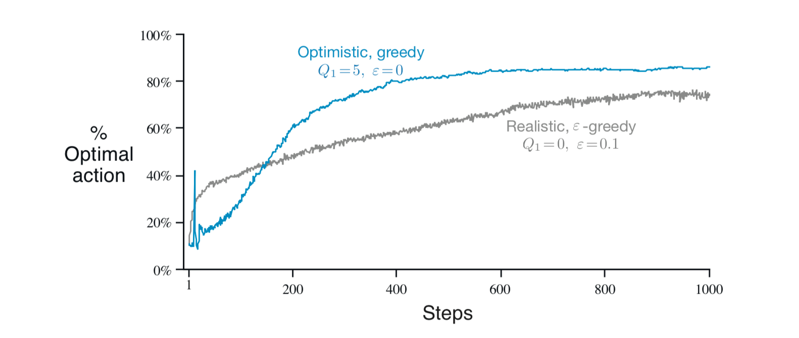
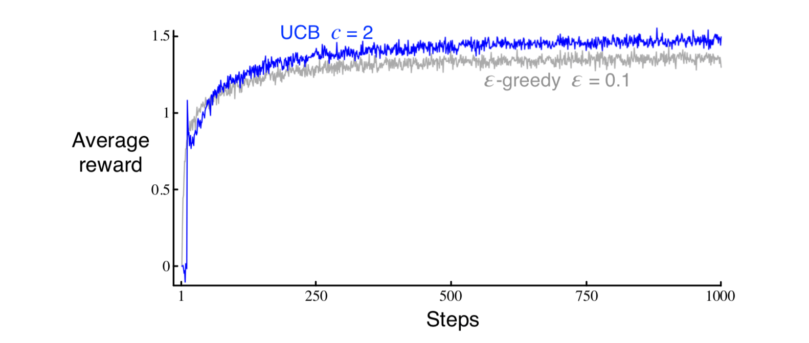
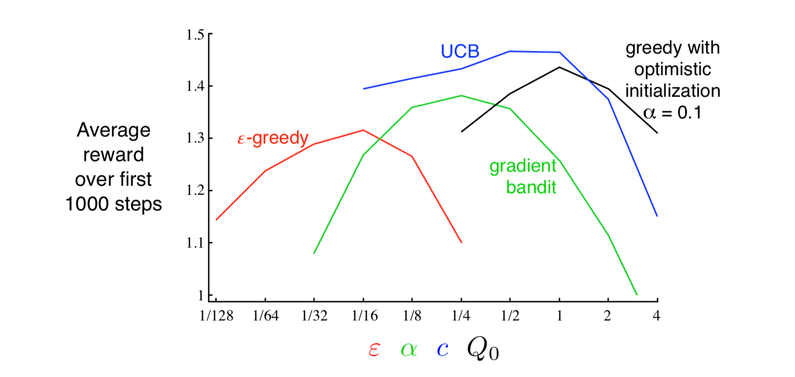

第2章 多臂赌博机问题
====================

区分强化学习与其他类型学习的最重要特征是，它使用训练信息来*评估*所采取的行动，而不是通过给予正确的行动来*指导*。这就是为了明确寻找良好行为而产生积极探索的需要。纯粹的评价反馈表明所采取的行动有多好，但不表明它是最好还是最坏的行动。另一方面，纯粹的指导性反馈表明采取的正确行动，与实际采取的行动无关。这种反馈是监督学习的基础，包括模式分类，人工神经网络和系统识别的大部分。在它们的纯粹形式中，这两种反馈是截然不同的：评价反馈完全取决于所采取的行动，而指导性反馈则与所采取的行动无关。

在本章中，我们在简化的环境中研究强化学习的评价方面，该方法不涉及学习如何在多种情况下行动。这种*非关联性*设置是大多数先前涉及评估反馈的工作已经完成的，并且它避免了完整强化学习问题的大部分复杂性。研究这个案例使我们能够最清楚地看到评价性反馈如何与指导性反馈的不同，但可以与之相结合。

我们探索的特定非关联评价性反馈问题是k臂赌博机问题的简单版本。我们使用这个问题来介绍一些基本的学习方法，我们将在后面的章节中对其进行扩展，以应用于完全强化学习问题。在本章的最后，我们通过讨论当赌博机问题变为关联时会发生什么，即在不止一种情况下采取行动，这种情况更接近完整的强化学习问题。

2.1 一个 $k$ 臂赌博机问题
-------------------------

考虑以下学习问题。你可以反复面对 $k$ 种不同的选择或行动。在每次选择之后，你会收到一个数值奖励，该奖励取决于你选择的行动的固定概率分布。你的目标是在一段时间内最大化预期的总奖励，例如，超过1000个操作选择或*时间步骤*。

这是 $k$臂赌博机问题的原始形式，通过类比于赌博机或"单臂强盗"命名，除了它有k个拉杆而不是一个。每个动作选择就像一个赌博机的拉杆游戏，奖励是击中累积奖金的奖金。通过反复的行动选择，你可以通过将你的行动集中在最佳杠杆上来最大化你的奖金。另一个类比是医生在一系列重病患者的实验治疗之间进行选择。每个动作都是治疗的选择，每个奖励都是患者的生存或幸福。今天，"赌博机问题"一词有时用于上述问题的概括，但在本书中我们用它来指代这个简单的情况。

在我们的 $k$ 臂赌博机中，只要选择了该动作，$k$个动作的每一个都有预期的或平均的奖励，让我们称之为该行动的*价值*。我们将在时间步 $t$ 选择的动作表示为 $A_t$，并将相应的奖励表示为 $R_t$。然后，对于任意动作 $a$ 的价值，定义 $q_{*}(a)$ 是给定 $a$选择的预期奖励：

$$q_{*}(a) \doteq \mathbb{E}[R_t|A_t=a]$$

如果你知道每个动作的价值，那么解决 $k$臂赌博机问题将是轻而易举的：你总是选择具有最高价值的动作。我们假设你不确定地知道动作价值，尽管你可能有估计值。 我们将在时间步骤$t$ 的动作 $a$ 的估计值表示为 $Q_t(a)$。 我们希望 $Q_t(a)$ 接近$q_{*}(a)$。

如果你保持对动作价值的估计，那么在任何时间步骤中至少有一个其估计值最大的动作。我们把这些称为*贪婪* 行为。 当你选择其中一个动作时，我们会说你正在*利用*你当前对动作价值的了解。相反，如果你选择了一个非常规动作，那么我们就说你正在*探索*，因为这可以让你提高你对非行动动作价值的估计。利用是在一步中最大化预期的奖励的最好的方法，但从长远来看，探索可能会产生更大的总回报。例如，假设贪婪行为的价值是确定的，而其他一些动作估计几乎同样好，但具有很大的不确定性。不确定性使得这些其他行动中的至少一个实际上可能比贪婪行动更好，但你不知道哪一个。如果你有很多时间步骤可以选择行动，那么探索非贪婪行动并发现哪些行动比贪婪行动可能会更好。在短期内，奖励在探索期间较低，但从长远来看更高，因为在你发现更好的行动之后，你可以多次利用*它们*。因为无法探索和利用任何单一行动选择，人们通常会提到探索和利用之间的"冲突"。

在任何特定情况下，探索或利用是否更好在某种复杂方式上取决于估计的精确值，不确定性和剩余步骤的数量。有许多复杂的方法可以平衡探索和利用 $k$臂赌博机的特定数学公式和相关问题。然而，这些方法中的大多数都对关于平稳性和先验知识做出了强有力的假设，这些假设在应用程序中被违反或无法验证，在随后的章节中我们会考虑完整的强化学习问题。当这些方法的假设不适用时，对这些方法的最优性或有限损失的保证并不太好。

在本书中，我们不担心以复杂的方式平衡探索和利用；我们只担心平衡它们。在本章中，我们为 $k$臂赌博机提出了几种简单的平衡方法，并表明它们比总是利用的方法更好。平衡探索和利用的需要是强化学习中出现的一个独特挑战；我们的 $k$臂赌博机问题的简单性使我们能够以一种特别清晰的形式展示这一点。

2.2 行动价值方法
----------------

我们首先仔细研究估算行动价值，并使用估算来做出行动选择决策的方法，我们统称为*行动价值方法*。回想一下，当选择该动作时，动作的真实价值就是平均奖励。估计这一点的一种自然方法是平均实际收到的奖励：

$$Q_t(a) \doteq \frac{在t之前采取a动作的奖励总和}{在t之前采取a动作的次数}
= \frac{\sum_{i=1}^{t-1}R_i \cdot \mathbb{1}_{A_i=a}}{\sum_{i=1}^{t-1}\mathbb{1}_{A_i=a}}$$

其中 $\mathbb{1}_{谓词}$表示随机变量，如果谓词为真，则为1，如果不是则为0。如果分母为零，那么我们将 $Q_t(a)$ 定义为某个默认值，例如0。当分母变为无穷大时，根据大数定律，$Q_t(a)$ 收敛于 $q_*(a)$。我们将其称为用于估计行动值的*样本平均*方法，因为每个估计值是相关奖励样本的平均值。当然，这只是估算行动价值的一种方式，而不一定是最佳方法。然而，现在让我们继续使用这种简单的估算方法，并转向如何使用估算来选择行动的问题。

最简单的动作选择规则是选择具有最高估计值的动作之一，即上一节中定义的贪婪动作之一。如果存在多个贪婪动作，则可以以任意方式（可能是随机的）在它们之间进行选择。我们把这个贪婪的动作选择方法写成

$$A_t = \mathop{argmax} \limits_{a} Q_t(a)$$

其中 $argmax_a$ 表示随后的表达式最大时的动作a（再次，任意地断开关系）。贪婪行动选择总是利用当前的知识来最大化立即奖励；它没有花时间采取明显劣质的行动来看看它们是否真的会更好。一个简单的替代方案是在大多数情况下贪婪地行动，但每隔一段时间，以较小的概率$\varepsilon$，从动作价值估计中独立地从具有相同概率的所有动作中随机选择。我们称使用此近乎贪婪的行动选择规则的方法为 $\varepsilon$*贪婪* 方法。这些方法的一个优点是，在步数增加的限度内，每个动作将被无限次采样，从而确保所有$Q_t(a)$ 收敛于 $q_*(a)$。 这当然意味着选择最优动作的概率收敛于大于$1-\varepsilon$ 的数，即接近确定。然而，这些只是渐近保证，并且对方法的实际有效性几乎没有说明。

*练习2.1* 在 $\varepsilon$ 贪婪动作选择中，对于两个动作的情况和$\varepsilon=0.5$， 选择贪婪动作的概率是多少？

2.3 10臂赌博机试验
------------------

为了粗略评估贪婪和 $\varepsilon$ 贪婪行动价值方法的相对有效性，我们在一系列测试问题上对它们进行了数值比较。这是一组2000个随机生成的 $k$臂赌博机问题，$k = 10$。 对于每个赌博机问题，如图2.1所示，动作价值$q_*(a)，a = 1 , \dots, 10$，根据具有均值为0和方差为1的正态（高斯）分布来选择。

**图2.1** 一个10臂的赌博机问题例子。根据具有均值和方差为0的正态分布选择十个动作的每一个的真值$q_*(a)$， 然后根据平均 $q_*(a)$单位方差正态分布选择实际奖励，如这些灰色分布显示。

然后，当应用于该问题的学习方法选择动作 $A_t$ 时， 从具有均值 $q_*(A_t)$和方差1的正态分布中选择实际奖励 $R_t$。这些分布在图2.1中以灰色显示。我们将这套测试任务称为*10臂赌博机试验*。对于任何学习方法，我们可以测量其性能和行为，因为它在应用于其中一个赌博机问题时经历了超过1000个时间步骤。这组成了一次*运行*。重复这样的独立运行2000次，每次运行都有不同的赌博机问题，我们便获得了学习算法的平均行为的度量。

如上所述，图2.2比较了10臂赌博机试验上的贪婪方法和两个 $\varepsilon$贪婪方法 （$\varepsilon=0.01$ 和 $\varepsilon=0.1$）。所有方法都使用样本平均技术形成了它们的动作值估计。上图显示了带有经验的预期奖励的增加。贪婪方法在开始时比其他方法改善略快，但随后在较低水平上稳定下来。它只获得了大约1的每步奖励，在这个测试平台上，最好的约为1.55。从长远来看，贪婪的方法表现得更糟，因为它经常被卡在执行欠佳的动作。下图显示贪婪的方法只在大约三分之一的任务中找到了最佳动作，其他三分之二的最佳动作的初始样本令人失望，而且它从未回归过它。$\varepsilon$贪婪方法最终表现得更好，因为他们会继续探索并提高他们识别最佳动作的机会。$\varepsilon=0.1$的方法探索得更多，并且通常更早地发现了最佳动作，但它从未在91％的时间内选择该动作。$\varepsilon=0.01$ 的方法改进得更慢，但最终，在关于图中所示的两种性能指标上会比 $\varepsilon=0.1$ 的方法更好。同时间，他还可以随着时间的推移减少 $\varepsilon$以试图获得最佳的高值和低值。

**图2.2** 10臂赌博机试验中的 $\varepsilon$贪婪行动价值方法的平均表现。这些数据是2000轮以上不同赌博机问题的平均值。所有方法都使用样本平均值作为其行动价值估计。

$\varepsilon$贪婪方法优于贪婪方法的优势取决于任务。例如，假设奖励方差较大，比如说10而不是1。有了更嘈杂的奖励，需要更多的探索才能找到最佳动作，并且 $\varepsilon$贪婪相对于贪婪的方法，使用方法应该更好。另一方面，如果奖励方差为零，则贪婪方法在尝试一次后就会知道每个动作的真实价值。在这种情况下，贪婪方法实际上可能表现最佳，因为它很快就能找到最佳动作，然后再也不会探索。但即使在确定性案例如果我们削弱其他一些假设，那么探索将是一个很大的优势。例如，假设赌博机任务是非平稳的，即行动的真实价值随着时间而变化。在这种情况下，即使在确定性案例中也需要进行探索，以确保其中一个非贪婪动作没有变得比贪婪动作更好。正如我们将在接下来的几章中看到的那样，非平稳性是在强化学习中最常遇到的情况。即使基础任务是固定的和确定的，学习者也面临着一系列类似赌博机的决策任务，随着学习的进行和个体的决策制定策略的变化，这些决策随着时间的推移而变化。强化学习需要在探索和利用之间取得平衡。

*练习2.2* 赌博机示例 考虑具有 $k=4$ 动作的$k$臂赌博机问题，表示为1，2，3和4。 对于此问题，考虑使用 $\varepsilon$贪婪动作选择，样本平均动作值估计的赌博机算法， 对于所有a，初始估计为$Q_1(a)=0$。 假设动作和奖励的初始序列是$A_1 = 1$，$R_1 = 1$，$A_2 = 2$，$R_2 = 1$，$A_3 = 2$，$R_3 = 2$，$A_4 = 2$，$R_4 = 2$，$A_5 = 3$，$R_5 = 0$。 在某些时间步骤中，$\varepsilon$情况可能已经发生，导致随机选择动作。在哪个时间步骤确实发生了？在哪些时间步骤可能发生？

*练习2.3* 在图2.2所示的比较中，从累积奖励和选择最佳动作的概率来看，哪种方法在长期运行中表现最佳？会有多好？定量地表达你的答案。

2.4 增量实现
------------

到目前为止我们讨论过的行动价值方法都将行动值估计为观察到的奖励的样本平均值。我们现在转向如何以计算上有效的方式计算这些平均值的问题，特别是具有恒定内存和恒定的时间步长计算。

为了简化表示法，我们专注于单一动作。让 $R_i$ 现在表示在第i次选择*此动作* 之后收到的奖励， 并且让 $Q_n`表示在其被选择 :math:`n-1$次之后其动作价值的估计，我们现在可以简单地将其写为

$$Q_n \doteq \frac{R_1 + R_2 + \dots + R_{n-1}}{n-1}$$

显而易见的实现是维护所有奖励的记录，然后在需要估计价值时执行该计算。但是，如果这样做，那么随着时间的推移，内存和计算要求会随着更多的奖励而增长。每个额外的奖励都需要额外的内存来存储它，并需要额外的计算来计算分子中的总和。

您可能怀疑，这不是必需的。通过处理每个新奖励所需的小的，恒定的计算，很容易设计用于更新平均值的增量公式。给定 $Q_n$ 和第n个奖励 $R_n$，所有n个奖励的新平均值可以通过以下计算得出

$$\begin{aligned}
Q_{n+1} &= \frac{1}{n}\sum_{i=1}^{n}R_i \\
        &= \frac{1}{n}(R_n + \sum_{i=1}^{n-1}R_i) \\
        &= \frac{1}{n}(R_n + (n-1)\frac{1}{n-1} \sum_{i=1}^{n-1}R_i) \\
        &= \frac{1}{n}(R_n + (n-1)Q_n) \\
        &= \frac{1}{n}(R_n + nQ_n-Q_n) \\
        &= Q_n + \frac{1}{n}(R_n - Q_n)
\end{aligned}$$

即使对于 $n=1$ 也保持，对于任意 $Q_1$，获得 $Q_2 = R_1$。 该实现仅需要$Q_n$ 和 n 的存储器，并且每个新的奖励仅需要小的计算（2.3）。此更新规则（2.3）是本书中经常出现的一种形式。 一般形式是

$$新估计 \leftarrow 旧估计 + 步长 [目标 - 旧估计]$$

表达式 $[目标 - 旧估计]$ 是估计中的误差。通过向"目标"迈出一步来减少它。目标被假定为指示移动的理想方向，尽管它可能是嘈杂的。例如，在上述情况下，目标是第n个奖励。

请注意，增量方法（2.3）中使用的步长参数（StepSize）会从时间步长到时间步长变化。在处理动作a的第n个奖励时，该方法使用步长参数 $\frac{1}{n}$。在本书中，我们使用 $\alpha$ 或者更一般地使用 $\alpha_t(a)$表示步长参数。

使用递增计算的样本平均值的完整赌博机算法的伪代码和 $\varepsilon$贪婪动作选择在下面的框中显示。 假设函数 $bandit(a)$采取行动并返回相应的奖励。

---
简单的赌博机算法

初始化，a 从 1 到 k：

$$\begin{aligned}
\begin{aligned}
&Q(a) \leftarrow 0 \\
&N(a) \leftarrow 0
\end{aligned}
\end{aligned}$$

循环：

$$\begin{aligned}
\begin{aligned}
&A \leftarrow
\begin{cases}
argmax_aQ(a) &  以 1-\varepsilon 概率 （随意打破关系）\\
随机动作 & 以 \varepsilon 概率
\end{cases} \\
&R \leftarrow bandit(a) \\
&N(A) \leftarrow N(A) + 1 \\
&Q(A) \leftarrow Q(A) + \frac{1}{N(A)}\left[R-Q(A)\right]
\end{aligned}
\end{aligned}$$

---

2.5 追踪非平稳问题
------------------

到目前为止讨论的平均方法适用于固定赌博机问题，即对于其中奖励概率不随时间变化的赌博机问题。如前所述，我们经常会遇到非常不稳定的强化学习问题。在这种情况下，给予最近的奖励比给长期的奖励更重要。最常用的方法之一是使用常量步长参数。例如，用于更新 $n-1$ 过去奖励的平均$Q_n$ 的增量更新规则（2.3）被修改为

$$Q_{n+1} \doteq Q_n + \alpha(R_n - Q_n)$$

步长参数 $\alpha \in (0, 1]$ 是常数。 这导致 $Q_{n+1}$是过去奖励和初始估计 $Q_1$ 的加权平均值：

$$\begin{aligned}
Q_{n+1} &= Q_n + \alpha(R_n - Q_n) \\
&= \alpha R_n + (1-\alpha)Q_n \\
&= \alpha R_n + (1-\alpha)[\alpha R_{n-1} + (1-\alpha)Q_{n-1}] \\
&= \alpha R_n + (1-\alpha)\alpha R_{n-1} + (1-\alpha)^2 \alpha R_{n-2} + \\
& \qquad \qquad \dots + (1-\alpha)^{n-1}\alpha R_1 + (1-\alpha)^nQ_1 \\
&= (1-\alpha)^nQ_1 + \sum_{i=1}^{n}\alpha(1-\alpha)^{n-i}R_i
\end{aligned}$$

我们称之为加权平均值， 因为权重之和为$(1-\alpha)^n + \sum_{i=1}^{n}\alpha(1-\alpha)^{n-i} = 1$，你可以自行验证。注意，给予奖励 $R_i$ 的权重 $\alpha(1-\alpha)^{n-i}$取决于之前有多少奖励，可以观察到为 $n-i$。 $1-\alpha$ 小于1，因此给予$R_i$ 的权重随着介入奖励数量的增加而减少。 实际上，权重根据 $1-\alpha$的指数呈指数衰减。 （如果 $1-\alpha=0$，则所有权重都在最后一个奖励 $R_n$上，因为我们预订 $0^0 = 1$。） 因此，这有时被称为*指数新近加权平均值*。

有时，逐步改变步长参数是很方便的。 让 $\alpha_n(a)$表示用于处理在第n次动作选择a之后收到的奖励的步长参数。正如我们已经注意到的，选择 $\alpha_n(a)=\frac{1}{n}$ 导致样本平均方法，保证通过大数定律收敛到真实的行动价值。但当然，对序列 $\{\alpha_n(a)\}$的所有选择都不能保证收敛。随机逼近理论中的一个众所周知的结果为我们提供了确保收敛概率为1所需的条件：

$$\sum_{n=1}^{\infty}\alpha_n(a) = \infty 和 \sum_{n=1}^{\infty}\alpha_n^2(a) < \infty$$

第一个条件是保证步骤足够大以最终克服任何初始条件或随机波动。第二个条件保证最终步骤变得足够小以确保收敛。

注意，对于样本平均情况，$\alpha_n(a)=\frac{1}{n}$ 都满足两个收敛条件，但对于恒定步长参数的情况不符合，$\alpha_n(a)=n$。在后一种情况下，不满足第二个条件，表明估计值从未完全收敛，但是响应于最近收到的奖励而继续变化。正如我们上面提到的，这在非平稳环境中实际上是可取的，并且在强化学习中最常见的是非常不稳定的问题。另外，满足条件（2.7）的步长参数序列通常非常缓慢地收敛或需要相当大的微调以获得令人满意的收敛速率。尽管满足这些收敛条件的步长参数序列通常用于理论工作，但它们很少用于应用和实证研究。

*练习2.4* 如果步长参数 $\alpha(a)$ 不是常数，则估计值 $Q_n$是先前收到的奖励的加权平均值，其权重不同于（2.6）给出的权重。对于一般情况，类似于（2.6），就步长参数的顺序而言，每个先前奖励的权重是什么？

*练习2.5（编程）* 设计并进行实验，以证明样本平均方法对非平稳问题的困难。使用10臂赌博机试验的修改版本，其中所有 $q_*(a)$开始相等，然后采取独立的随机游走 （比如在每一步通过向所有 $q_*(a)$添加均值为0且标准差为0.01的正态分布增量）。使用样本平均值，增量计算和使用常量步长参数的另一个动作值方法，$\alpha=0.1$，绘制如图2.2所示的动作值方法的图。使用 $\varepsilon=0.1$ 和更长的运行，比如10000步。

2.6 乐观的初始值
----------------

到目前为止我们讨论的所有方法在某种程度上都依赖于初始行动价值估计$Q_1(a)$。在统计语言中，这些方法的初始估计存在偏差。对于样本平均方法，一旦所有动作至少被选择一次，偏差就会消失，但对于具有常数 $\alpha$的方法，偏差是永久性的，尽管随着时间的推移逐渐减少，如（2.6）所示。在实践中，这种偏差通常不是问题，有时可能非常有用。缺点是如果只是将它们全部设置为零，初始估计实际上变成了一组必须由用户选择的参数。好处是，它们提供了一种简单的方法来提供关于可以预期的奖励水平的一些先验知识。

初始行动价值也可以用作鼓励探索的简单方法。假设我们没有将初始动作值设置为零，就像我们在10臂赌博机试验中所做的那样，我们将它们全部设置为+5。回想一下，该问题中的 $q_*(a)$是从具有均值0和方差1的正态分布中选择的。因此，初始估计值+5非常乐观。但这种乐观主义鼓励采取行动价值方法进行探索。无论最初选择哪种行为，奖励都低于起始估计；学习者转向其他行动，对其收到的奖励感到"失望"。结果是在值估计收敛之前，所有操作都会尝试多次。即使一直选择贪婪的行为，系统也会进行大量的探索。

图2.3显示了对于所有a，使用 $Q_1(a)=+5$的贪婪方法的10臂赌博机试验的性能。 为了比较，还显示了一个 $\varepsilon$贪婪方法，其中 $Q_1(a)= 0$。最初，乐观方法表现更差，因为它探索更多，但最终它表现更好，因为它的探索随着时间的推移而减少。我们称这种技术为鼓励探索*乐观的初始值*。我们认为它是一个简单的技巧，对于静止问题非常有效，但它远不是一个鼓励探索的普遍有用的方法。例如，它不适合非平稳问题，因为它的驱动对于探索本质上是暂时的。如果任务发生变化，再次需要探索，这种方法无法帮助。实际上，任何以特殊方式关注初始条件的方法都不可能对一般的非平稳情况有所帮助。时间的开始只出现一次，因此我们不应该过分关注它。这种批评也适用于样本平均方法，它也将时间的开始视为一种特殊的方法事件，平均所有后续奖励的权重相等。然而，所有这些方法都非常简单，其中之一，或者它们的一些简单组合，在实践中通常是足够的。在本书的其余部分，我们经常使用其中一些简单的探索技术。

**图2.3** 乐观的初始行动价值估计对10臂赌博机试验的影响。两种方法都使用恒定的步长参数，$alpha=0.1$。

*练习2.6：神秘的尖峰* 图2.3所示的结果应该非常可靠，因为它们是超过2000个随机选择的10臂赌博机任务的平均值。那么，为什么乐观方法曲线的早期会出现振荡和峰值？换句话说，什么可能使这种方法在特定的早期步骤中表现得更好或更差？

*练习2.7：无偏恒定步长技巧* 在本章的大部分内容中，我们使用样本平均值来估计动作值，因为样本平均值不会产生恒定步长的初始偏差（参见导致（2.6）的分析）。然而，样本平均值并不是一个完全令人满意的解决方案，因为它们可能在非平稳问题上表现不佳。是否有可能避免不变步长的偏差，同时保留其对非平稳问题的优势？一种方法是使用步长

$$\beta_n \doteq \alpha / \overline{o}_n$$

处理特定动作的第n个奖励，其中 $\alpha>0$是常规常量步长，$\overline{o}_n$ 是从0开始的跟踪：

$$\overline{o}_n \doteq \overline{o}_{n-1} + \alpha(1-\overline{o}_{n-1}) for n \ge 0, with \overline{o}_0 \doteq 0$$

进行如（2.6）中的分析，以表明 $Q_n$ 是指数的新近加权平均值，\*没有初始偏差\*。

2.7 上限置信区间动作选择
------------------------

探索是必要的，因为行动价值估计的准确性始终存在不确定性。贪婪的行为是目前看起来最好的行动，但其他一些行动可能实际上更好。$\varepsilon$贪婪行动选择迫使不贪婪的行动被尝试，而不是那些几乎贪婪或特别不确定的动作。最好根据它们实际上最优的潜力来选择非贪婪行动，同时考虑到它们的估计与最大值的接近程度以及这些估计中的不确定性。这样做的一种有效方法是根据选择行动

$$A_t \doteq \mathop{argmax} \limits_{a} \left[Q_t(a) + c \sqrt{\frac{\ln{t}}{N_t(a)}}\right]$$

其中 $\ln{t}$ 表示t的自然对数（ $e \approx 2.71828$必须提高到等于t的数量）， $N_t(a)$表示在时间t之前选择动作a的次数（（2.1）中的分母），数字 $c>0$控制探索的程度。 如果 $N_t(a)=0$，则a被认为是最大化动作。

这种*上限置信区间*（UCB）行动选择的想法是，平方根项是对一个值估计的不确定性或方差的度量。因此，最大化的数量是动作a的可能真实值的一种上限，其中c确定置信水平。每次选择a时，不确定性可能会降低： $N_t(a)$递增，并且，正如它在分母中出现的那样，不确定性项减少。另一方面，每次选择除a之外的动作时，t增加但 $N_t(a)$不增加；因为t出现在分子中，不确定性估计值会增加。使用自然对数意味着随着时间的推移，增加量会变小，但是是无限制；最终将选择所有操作，但是将随着时间的推移，具有较低值估计值或已经频繁选择的操作的选择频率会降低。

10臂赌博机试验的UCB结果如图2.4所示。如本文所示，UCB通常表现良好， 但比起$\varepsilon$贪婪，UCB更难向本书其余部分所考虑的更为普遍的强化学习环境扩展。一个难点在于处理非平稳问题；比这些更复杂的方法将需要在2.5节中介绍。另一个难点是处理大的状态空间，特别是当使用本书第二部分中开发的函数逼近时。在这些更高级的设置中，UCB动作选择的想法通常是不实际的。

**图2.4** 10臂赌博机试验上UCB动作选择的平均表现。如图所示，除了在前$k$ 个步骤中， 当它在尚未尝试的动作中随机选择时，UCB通常比$\varepsilon$ 贪婪动作选择"更好。

*练习2.8 USB尖峰* 在图2.4中，UCB算法在第11步显示出明显的性能峰值。为什么是这样？请注意，为了使您的答案完全令人满意，它必须解释为什么奖励在第11步增加以及为什么在随后的步骤中减少。提示：如果 $c=1$，则尖峰不太突出。

2.8 赌博机问题的梯度算法
------------------------

到目前为止，在本章中我们已经考虑了估算行动价值并使用这些估计值来选择行动的方法。这通常是一种很好的方法，但它不是唯一可行的方法。在本节中，我们考虑为每个动作a学习数字*偏好*，我们将其表示为 $H_t(a)$。偏好越大，采取行动的次数越多，但偏好在奖励方面没有解释。只有一种行为相对于另一种行为的相对偏好才是重要的；如果我们将1000添加到所有动作首选项，则对动作概率没有影响，动作概率是根据soft-max分布（如Gibbs或Boltzmann分布）确定的，如下所示：

$$Pr\{A_t=a\} \doteq \frac{e^{H_t(a)}}{\sum_{b=1}^{k}e^{H_t(b)}} \doteq \pi_t(a)$$

在这里，我们还引入了一个有用的新符号，$\pi_t(a)$，表示在时间t采取行动的概率。最初，所有动作偏好都是相同的（例如，对于所有a，$H_1(a)=0$），使得所有动作具有相同的被选择概率。

*练习2.9* 指出在两个动作的情况下，soft-max分布与统计学和人工神经网络中经常使用的逻辑或sigmoid函数给出的相同。

基于随机梯度上升的思想，存在用于该设置的自然学习算法。在每个步骤中，在选择动作 $A_t$ 并接收奖励 $R_t$ 之后，动作偏好通过以下方式更新：

$$\begin{aligned}
H_{t+1}(A_t) &\doteq H_t(A_t) + \alpha(R_t-\overline{R}_t)(1-\pi_t(A_t))， &和 \\
H_{t+1}(a) &\doteq H_t(a) - \alpha(R_t-\overline{R}_t)\pi_t(a)，&对所有 a \ne A_t
\end{aligned}$$

其中 $\alpha>0$ 是步长参数，$\overline{R}_t \in \mathbb(R)$是所有奖励的平均值，包括时间t，可以按照第2.4节（或第2.5节，如果问题是非平稳的）所述逐步计算。$\overline{R}_t$ 术语作为比较奖励的基线。 如果奖励高于基线，那么将来获取$A_t$ 的概率增加;如果奖励低于基线，则概率降低，未选择的动作向相反方向移动。

图2.5显示了对10臂赌博机试验变体的梯度赌博机算法的结果，其中真实的预期奖励是根据正态分布选择的，平均值为+4而不是零（并且单位方差与之前一样）。由于奖励基线术语瞬间适应新的水平，所以所有奖励的上移对梯度赌博机算法完全没有影响。但如果基线被省略（即，如果 $\overline{R}_t$在（2.12）中被视为常数零），那么性能将显着降低，如图所示。

**图2.5** 当 $q_*(a)$ 被选择为接近+4而不是接近零时，在10臂赌博机试验上具有和不具有奖励基线的梯度赌博机算法的平均性能。

---
随机梯度上升的赌博机梯度算法

通过将其理解为梯度上升的随机近似，可以更深入地了解梯度赌博机算法。在精确的梯度上升中，每个动作偏好 $H_t(a)$将与增量对性能的影响成比例增加：

$$H_{t+1}(a) \doteq H_t(a) + \alpha\frac{\partial \mathbb{E}[R_t]}{\partial H_t(a)}$$

这里的性能衡量指标是预期的奖励：

$$\mathbb{E}[R_t] = \sum_{x}\pi_t(x)q_*(x)$$

并且增量效应的度量是该性能度量相对于动作偏好的*偏导数*。当然，在我们的情况下不可能完全实现梯度上升，因为假设我们不知道$q_*(x)$，但实际上我们的算法（2.12）的更新等于（2.13）预期值，使算法成为*随机梯度上升* 的一个实例。显示这一点的计算只需要基础微积分，但需要几个步骤。首先，我们仔细研究一下确切的性能梯度：

$$\begin{aligned}
\frac{\partial \mathbb{E}[R_t]}{\partial H_t(a)} &= \frac{\partial}{\partial H_t(a)}\left[\sum_{x}\pi_t(x)q_*(x)\right] \\
&= \sum_{x}q_*(x)\frac{\partial \pi_t(x)}{\partial H_t(a)} \\
&= \sum_{x}(q_*(x)-B_t)\frac{\partial \pi_t(x)}{\partial H_t(a)}
\end{aligned}$$

其中 $B_t$ 称为*基线*，可以是任何不依赖于x的标量。我们可以在这里包括基线而不改变相等性，因为梯度在所有动作上总和为零，$\sum_{x}\frac{\partial \pi_t(x)}{\partial H_t(a)} = 0$，当 $H_t(a)$改变时，一些动作的概率上升，有些下降，但变化的总和必须为零，因为概率的总和总是一。

接下来，我们将和的每个项乘以 $\pi_t(x) / \pi_t(x)$：

$$\frac{\partial \mathbb{E}[R_t]}{\partial H_t(a)} =
    \sum_{x}\pi_t(x)(q_*(x)-B_t)\frac{\partial \pi_t(x)}{\partial H_t(a)}/\pi_t(x)$$

该等式现在采用期望的形式，对随机变量 $A_t$ 的所有可能值x求和，然后乘以取这些值的概率。从而：

$$\begin{aligned}
&= \mathbb{E}\left[ (q_*(A_t)-B_t)\frac{\partial \pi_t(A_t)}{\partial H_t(a)}/\pi_t(A_t) \right] \\
&= \mathbb{E}\left[ (R_t-\overline{R}_t)\frac{\partial \pi_t(A_t)}{\partial H_t(a)}/\pi_t(A_t) \right]
\end{aligned}$$

这里我们选择了基线 $B_t=\overline{R}_t$ 和替换 $R_t$ 为 $q_*(A_t)$，这是允许的，因为 $\mathbb{E}[R_t|A_t] = q_*(A_t)$。 很快我们将确定$\frac{\partial \pi_t(x)}{\partial H_t(a)}=\pi_t(x)(\mathbb{1}_{a=A_t}-\pi_t(a))$，其中，如果 $a = x$ 则定义 $\mathbb{1}_{a=A_t}$为1，否则为0。假设现在，我们有

$$\begin{aligned}
&= \mathbb{E}\left[ (R_t-\overline{R}_t) \pi_t(A_t) (\mathbb{1}_{a=A_t}-\pi_t(a))/\pi_t(A_t) \right] \\
&= \mathbb{E}\left[ (R_t-\overline{R}_t)(\mathbb{1}_{a=A_t}-\pi_t(a)) \right]
\end{aligned}$$

回想一下，我们的计划是将性能梯度编写为我们可以在每个步骤上采样的预期，就像我们刚刚完成的那样，然后更新与样本成比例的每个步骤。将上述期望的样本替换为（2.13）中的性能梯度，得出：

$$H_{t+1}(a) = H_t(a) + \alpha(R_t-\overline{R}_t)(\mathbb{1}_{a=A_t}-\pi_t(a))，对于所有a$$

您可能认为它等同于我们的原始算法（2.12）。

因此，它只是表明这一点$\frac{\partial \pi_t(x)}{\partial H_t(a)}=\pi_t(x)(\mathbb{1}_{a=A_t}-\pi_t(a))$，正如我们假定的一样。回想一下倒数的标准商法则：

$$\frac{\partial}{\partial x} \left[ \frac{f{x}}{g{x}} \right] =
    \frac{ \frac{\partial f(x)}{\partial x}g(x) - f(x)\frac{\partial g(x)}{\partial x}}{g(x)^2}$$

使用这个，我们可以写出

$$\begin{aligned}
\frac{\partial \pi_t(x)}{\partial H_t(a)} &= \frac{\partial}{\partial H_t(a)}\pi_t(x) \\
&= \frac{\partial}{\partial H_t(a)}\left[ \frac{e^{H_t(x)}}{\sum_{y=1}^{k}e^{H_t(y)}} \right] \\
&= \frac{ \frac{\partial e^{H_t(x)}}{\partial H_t(a)} \sum_{y=1}^{k}e^{H_t(y)} - e^{H_t(x)}\frac{\partial \sum_{y=1}^{k}e^{H_t(y)}}{\partial H_t(a)} }{(\sum_{y=1}^{k}e^{H_t(y)})^2} \\
&= \frac{ \mathbb{1}_{a=x}e_{H_t(x)}\sum_{y=1}^{k}e^{H_t(y)} - e^{H_t(x)}e^{H_t(a)} }{(\sum_{y=1}^{k}e^{H_t(y)})^2} (因为 \frac{\partial e^x}{\partial x}=e^x) \\
&= \frac{\mathbb{1}_{a=x}e_{H_t(x)}}{\sum_{y=1}^{k}e^{H_t(y)}} - \frac{e^{H_t(x)}e^{H_t(a)}}{(\sum_{y=1}^{k}e^{H_t(y)})^2} \\
&= \mathbb{1}_{a=x}\pi_t(x) - \pi_t(x)\pi_t(a) \\
&= \pi_t(x)(\mathbb{1}_{a=x} - \pi_t(a)) &Q.E.D.
\end{aligned}$$

我们刚刚表明，梯度赌博机算法的预期更新等于预期奖励的梯度，因此该算法是随机梯度上升的实例。这确保了该算法具有稳健的收敛特性。

请注意，除了不依赖于所选操作之外，我们不需要奖励基线的任何属性。例如，我们可以将其设置为零或1000，并且算法仍然是随机梯度上升的实例。基线的选择不会影响算法的预期更新，但它确实会影响更新的方差，从而影响收敛速度（如图2.5所示）。选择它作为奖励的平均值可能不是最好的，但它很简单并且在实践中运作良好。

---

2.9 关联搜索（语境赌博机）
--------------------------

到目前为止，在本章中我们只考虑了非关联性任务，即不需要将不同行为与不同情况联系起来的任务。在这些任务中，学习者要么在任务静止时尝试找到单个最佳动作，要么在任务非平稳时随着时间的推移而尝试跟踪最佳动作。但是，在一般的强化学习任务中，存在多种情况，目标是学习策略：从状态到在这些情况下最佳的行为的映射。为完整问题设置台阶，我们简要讨论非关联任务扩展到关联设置的最简单方法。

举个例子，假设有几个不同的 $k$臂赌博机任务，并且在每一步中你都会随机对抗其中一个。因此，赌博机任务从一步到另一步随机变化。这在你看来是一个单一的，非平稳的$k$ 臂赌博机任务，其真实动作值从一步到另一步随机变化。您可以尝试使用本章中描述的可以处理非平稳性的方法之一，但除非真实的操作值变化缓慢，否则这些方法将无法正常工作。但是，现在假设，当为您选择赌博机任务时，您将获得一些关于其身份的独特线索（但不是其动作价值）。也许你正面临一个真正的赌博机，它改变它的显示颜色来改变了它的动作价值。现在，您可以学习一项策略，将每个任务与你看到的颜色相关联，并在面对该任务时采取最佳操作。例如，如果是红色，选择第1个摇臂；如果是绿色，选择第2个摇臂。在没有任何区分一个赌博机任务的信息的情况下，通过正确的策略，你通常可以做得更好。

这是一个关联搜索任务的示例，因为它涉及试错学习以搜索最佳操作，以及这些操作与它们最佳的情况的关联。关联搜索任务现在通常在文献中被称为语境赌博机。联合搜索任务介于 $k$臂赌博机问题和完全强化学习问题之间。它们就像完整的强化学习问题，因为它们涉及学习策略，但就像我们的 $k$臂赌博机问题的版本一样，每个动作只能立即得到奖励。如果允许行动来影响下一个情况以及奖励，那么我们就会有完整的强化学习问题。我们将在下一章中提出这个问题，并在本书的其余部分考虑它的影响。

2.10 总结
---------

我们在本章中介绍了几种平衡探索和利用的简单方法。$\varepsilon$贪婪方法随机选择一小部分时间，而UCB方法确定性地选择，但通过巧妙地在每个步骤中有利于（favoringat）目前为止接收到更少样本的动作来实现探索。梯度赌博机算法估计的不是动作价值，而是动作偏好，并且使用soft-max分布以分级的概率方式支持更优选的动作。初始化估计的简单技巧积极地促使甚至贪婪的方法也进行显著探索。

很自然地会问这些方法中哪一种最好。虽然这是一个难以回答的问题，但我们当然可以在我们在本章中使用的10臂赌博机试验上运行它们并比较它们的性能。一个复杂因素是它们都有一个参数；要获得有意义的比较，我们必须将其性能视为其参数的函数。到目前为止，我们的图表显示了每种算法和参数设置随时间学习的过程，以产生该算法和参数设置的学习曲线。如果我们绘制了所有算法和所有参数设置的学习曲线，那么图表将过于复杂和拥挤，无法进行清晰的比较。相反，我们通过1000步的平均值总结完整的学习曲线；该值与学习曲线下的面积成比例。图2.6显示了本章中各种赌博机算法的测量方法，每个算法都是x轴上单个刻度上显示的自身参数的函数。这种图形称为*参数学习*。请注意，参数值的变化因子为2，并以对数刻度表示。还要注意每种算法性能的特征呈倒U形状；所有算法在其参数的中间值上表现最佳，既不太大也不太小。在评估方法时，我们不仅要关注它在最佳参数设置下的表现，还要关注它对参数值的敏感程度。所有这些算法都相当不敏感，在一系列参数值上表现良好，这些参数值变化大约一个数量级。总的来说，在这个问题上，UCB似乎表现最佳。

**图2.6** 本章介绍的各种赌博机算法的参数研究。每个点是在其参数的特定设置下使用特定算法通过1000步获得的平均奖励。

尽管它们很简单，但我们认为本章介绍的方法可以被认为是最先进的。有更复杂的方法，但它们的复杂性和假设使得它们对于我们真正关注的完整强化学习问题是不切实际的。从第5章开始，我们提出了解决完整强化学习问题的学习方法，这些方法部分地使用了本章探讨的简单方法。

虽然本章探讨的简单方法可能是我们目前所能做的最好的方法，但它们远远不能完全满意地解决平衡探索和利用的问题。

在 $k$臂赌博机问题中平衡探索和利用的一种经过充分研究的方法是计算一种称为*Gittins指数* 的特殊动作价值。在某些重要的特殊情况下，这种计算是易处理的，直接导致最优解，尽管它确实需要完全了解可能存在的问题，我们通常认为这是不可用的。此外，这种方法的理论和计算易处理性似乎都没有概括为我们在本书其余部分考虑的完整强化学习问题。

Gittins索引方法是*贝叶斯*方法的一个实例，它假定在动作价值上已知初始分布，然后在每个步骤之后准确更新分布（假设真实动作价值是静止的）。通常，更新计算可能非常复杂，但对于某些特殊分布（称为*共轭先验*），它们很容易。一种可能性是根据其作为最佳动作的后验概率在每个步骤选择动作。这种方法，有时称为*后验采样* 或*汤普森采样*，通常与我们在本章中介绍的最佳无分布方法类似。

在贝叶斯环境中，甚至可以设想计算探索和利用之间的最佳平衡。可以针对任何可能的动作计算每个可能的立即奖励的概率以及由此产生的后验分布与动作价值的关系。这种不断发展的分布成为问题的*信息状态*。给定一个视野，比如1000步，人们可以考虑所有可能的行动，所有可能的结果奖励，所有可能的下一步行动，所有下一个奖励，等等所有1000个步骤。给定假设，可以确定每个可能的事件链的奖励和概率，并且只需要选择最好的事件。但是，可能性树的增长非常迅速；即使只有两个动作和两个奖励，树也会有$2^2000$ 个叶子。完全执行这种巨大的计算通常是不可行的，但也许它可以有效地近似。这种方法将有效地将赌博机问题转化为完全强化学习问题的一个实例。最后，我们可以使用近似强化学习方法，例如本书第二部分中介绍的方法来实现这一最优解。但这是一个研究课题，超出了这本入门书的范围。

*练习2.11（编程）* 为练习2.5中概述的非平稳情况制作类似于图2.6的图像。包括常量步长 $varepsilon$ 贪婪算法，$\alpha=0.1$。使用200,000步的运行，并且，作为每个算法和参数设置的性能度量，使用过去100,000步的平均奖励。

书目和历史评论
--------------

**2.1** 在统计学，工程学和心理学中研究了赌博机问题。在统计数据中，赌博机问题属于Thompson（1933,1934）和Robbins（1952）引入并由Bellman（1956）研究的"实验的顺序设计"分类。Berry和Fristedt（1985）从统计学的角度提供了对赌博机问题的广泛处理。Narendra和Thathachar（1989）从工程角度处理赌博机问题，提供了关注它们的各种理论传统的良好讨论。在心理学中，强盗问题在统计学习理论中发挥了作用（例如，Bush和Mosteller，1955；Estes，1950）。

术语贪婪通常用于启发式搜索文献中（例如，Pearl，1984）。探索和利用之间的冲突在控制工程中被称为识别（或估计）与控制之间的冲突（例如，Witten，1976b）。Feldbaum（1965）将其称为双重控制问题，指的是在试图控制不确定系统时，需要同时解决识别和控制这两个问题。在讨论遗传算法的各个方面时，Holland（1975）强调了这种冲突的重要性，将其称为利用需求与新信息需求之间的冲突。

**2.2** 我们的 $k$臂赌博机问题的行动价值方法最初由Thathachar和Sastry（1985）提出。这些通常被称为学习自动机文献中的估计算法。动作价值一词归功于Watkins（1989）。第一个使用"$\varepsilon$贪婪方法"的也可能是Watkins（1989，p.187），但这个想法很简单，以至于早期使用似乎很可能。

**2.4-5** 这种材料属于随机迭代算法的一般标题，Bertsekas和Tsitsiklis（1996）对此进行了详细介绍。

**2.6** Sutton（1996）在强化学习中使用了乐观初始化。

**2.7** Lai和Robbins（1985），Kaelbling（1993b）和Agrawal（1995）对使用上限置信边界的估计进行了早期工作。我们在这里提出的UCB算法在文献中称为UCB1，最初由Auer，Cesa-Bianchi和Fischer（2002）开发。

**2.8** 梯度赌博机算法是Williams（1992）引入的基于梯度的强化学习算法的一个特例，后来发展为我们在本书后面讨论的演员评论和策略梯度算法。我们在这里的发展受到了Balaraman Ravindran（个人通信）的影响。Greensmith，Bartlett和Baxter（2002,2004）和Dick（2015）在那里提供了对基线选择的进一步讨论。像这样的算法的早期系统研究由Sutton（1984）完成。动作选择规则（2.11）的术语*soft-max*归因于Bridle（1990）。这条规则似乎是Luce（1959）首次提出的。

**2.9** Barto，Sutton和Brouwer（1981）引入了术语关联搜索和相应的问题。关联强化学习这个术语也被用于关联搜索（Barto和Anandan，1985），但我们更倾向于将该术语保留为完整强化学习问题的同义词（如Sutton，1984）。（并且，正如我们所指出的，现代文学也使用术语"语境赌博机"来解决这个问题。）我们注意到Thorndike效应定律（引自第1章）通过引用情境之间的关联关系的形成来描述关联搜索（状态）和行动。根据操作性或工具性条件的术语（例如，Skinner，1938），判别性刺激是一种刺激，表示存在特定的强化偶然事件。在我们的术语中，不同的判别刺激对应于不同的状态。

**2.10** Bellman（1956）是第一个展示如何使用动态规划来计算贝叶斯问题解决方案中探索和利用之间的最佳平衡的人。Gittins指数方法归功于Gittins和Jones（1974）。Duff（1995）展示了如何通过强化学习来学习Gittins指数的强盗问题。Kumar（1985）的调查对这些问题的贝叶斯和非贝叶斯方法进行了很好的讨论。信息状态一词来自关于部分可观察MDP的文献；参见，例如，Lovejoy（1991）。

其他理论研究侧重于探索的效率，通常表示算法可以快速实现最优决策策略。形式化探索效率的一种方法是通过适应强化学习监督学习算法的*样本复杂度*的概念， 这是算法在学习目标函数时需要达到所需精度的训练样本的数量。对强化学习算法的探索的样本复杂性的定义，是算法不选择近似最优动作的时间步数个数（Kakade，2003）。Li（2012）在对强化学习中探索效率的理论方法的调查中讨论了这个和其他几种方法。Russo，VanRoy，Kazerouni，Osband和Wen（2018）提供了对Thompson采样的全面现代处理。
